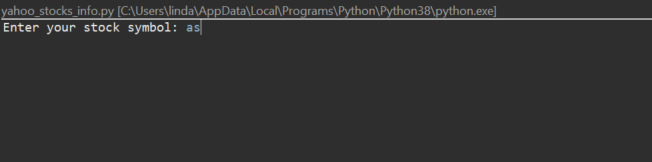
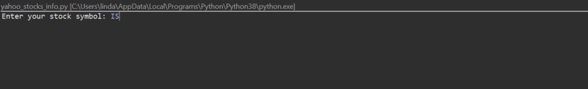

# StockCollector
 Returns today's stock values for a given company symbol. 
 
 # How It Works
 1) The user is prompted to input a company stock's symbol.
 2) If the user's symbol cannot be found via Yahoo Finnance's historical stock data, the user is notified of this and is prompted again to re-enter a new company stock's symbol. If the user inputs an invalid company stock symbol once again,  the user will be notified and prompted to input again. The application will not move from this step until the user has inputted a valid company stock symbol.
 3) With the valid company symbol, the application will retrieve the most recent day's stock data from requesting the RapidAPI Yahoo Finnance API.
 4) If the most recent day's stock data is not the same date as today, the application will notify the user that no stocks for their company symbol has been traded today.
 5) If the most recent day's stock data is the same date as today, the application will notify the user of today's open, high, low, and close stock values for the company that the user had specified in their symbol.
 
 **Note About Valid Stock Symbols** : The application treats the user's input as not case-sensitive (i.e. for ISRG, inputs such as iSRG, isrg, iSrG are seen as valid and equivalent) 
 
 # Walkthrough Gifs
 Incorrect Stock Symbols + ISRG Stocks on 1/10/2021 (no stocks traded day)\
   
 
 ISRG Stocks on 1/11/2021 (stocks traded day)\
 

# Notes
-See requirements.txt for a list of tools that help built this application.\
-See yahoo_stocks_info.py for more information on the application's implementation via comments

